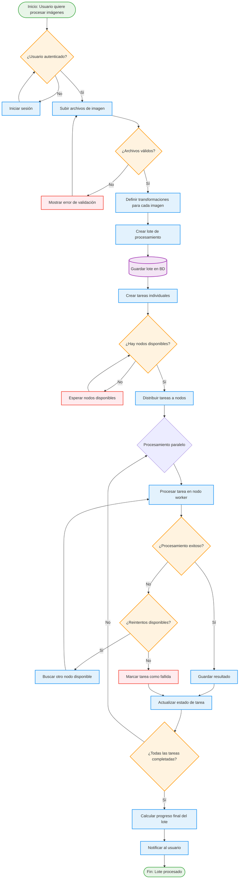
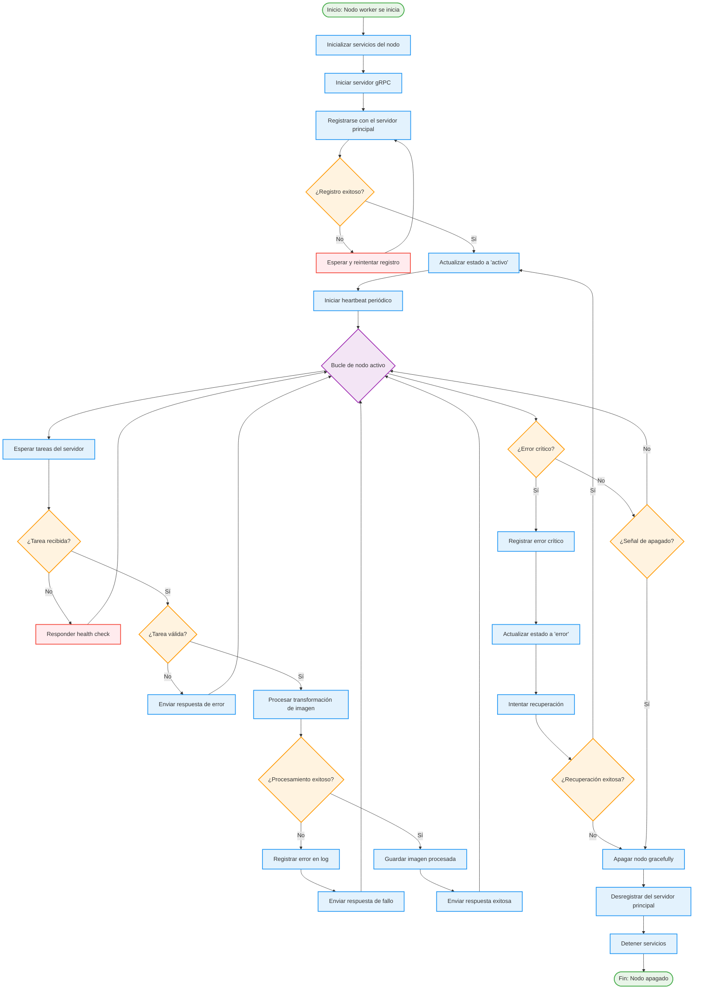

# Diagrama de Actividades UML - Flujos de Procesos del Sistema Distribuido

## 1. Flujo de Procesamiento de Lote de Imágenes

## 2. Flujo de Registro y Monitoreo de Nodos

## 3. Flujo de Monitoreo del Sistema

```mermaid
flowchart TD
    StartMonitoring([Inicio: Sistema de monitoreo]) --> InitializeMonitor[Inicializar monitor del sistema]
    
    InitializeMonitor --> LoadConfiguration[Cargar configuración de monitoreo]
    LoadConfiguration --> StartMonitoringLoop[Iniciar bucle de monitoreo]
    
    StartMonitoringLoop --> MonitoringCycle{Ciclo de monitoreo}
    
    MonitoringCycle --> CheckAllNodes[Verificar estado de todos los nodos]
    CheckAllNodes --> PerformHealthChecks[Realizar health checks]
    
    PerformHealthChecks --> AnalyzeResults[Analizar resultados]
    AnalyzeResults --> IdentifyUnhealthyNodes{¿Hay nodos no saludables?}
    
    IdentifyUnhealthyNodes -->|Sí| MarkNodesUnhealthy[Marcar nodos como no saludables]
    MarkNodesUnhealthy --> ReallocateTasks[Reasignar tareas de nodos no saludables]
    ReallocateTasks --> SendAlerts[Enviar alertas a administradores]
    
    IdentifyUnhealthyNodes -->|No| UpdateMetrics[Actualizar métricas del sistema]
    SendAlerts --> UpdateMetrics
    
    UpdateMetrics --> CheckSystemLoad[Verificar carga del sistema]
    CheckSystemLoad --> AnalyzePerformance[Analizar rendimiento]
    
    AnalyzePerformance --> OptimizeDistribution{¿Optimización necesaria?}
    
    OptimizeDistribution -->|Sí| RebalanceWorkload[Rebalancear carga de trabajo]
    RebalanceWorkload --> UpdateLoadBalancer[Actualizar estrategia de balanceo]
    UpdateLoadBalancer --> LogOptimization[Registrar optimización realizada]
    
    OptimizeDistribution -->|No| CheckBatchProgress[Verificar progreso de lotes]
    LogOptimization --> CheckBatchProgress
    
    CheckBatchProgress --> UpdateBatchStatuses[Actualizar estados de lotes]
    UpdateBatchStatuses --> GenerateReports[Generar reportes de estado]
    
    GenerateReports --> WaitMonitoringInterval[Esperar intervalo de monitoreo]
    WaitMonitoringInterval --> MonitoringCycle
    
    MonitoringCycle --> StopSignal{¿Señal de parada?}
    StopSignal -->|No| MonitoringCycle
    StopSignal -->|Sí| CleanupMonitoring[Limpiar recursos de monitoreo]
    
    CleanupMonitoring --> SaveFinalReports[Guardar reportes finales]
    SaveFinalReports --> EndMonitoring([Fin: Monitoreo detenido])
    
    %% Estilos
    classDef startEnd fill:#e8f5e8,stroke:#4caf50,stroke-width:2px
    classDef process fill:#e3f2fd,stroke:#2196f3,stroke-width:2px
    classDef decision fill:#fff3e0,stroke:#ff9800,stroke-width:2px
    classDef optimization fill:#e8f5e8,stroke:#8bc34a,stroke-width:2px
    classDef alert fill:#ffebee,stroke:#f44336,stroke-width:2px
    
    class StartMonitoring,EndMonitoring startEnd
    class InitializeMonitor,LoadConfiguration,StartMonitoringLoop,CheckAllNodes,PerformHealthChecks,AnalyzeResults,UpdateMetrics,CheckSystemLoad,AnalyzePerformance,CheckBatchProgress,UpdateBatchStatuses,GenerateReports,WaitMonitoringInterval,CleanupMonitoring,SaveFinalReports process
    class MonitoringCycle,IdentifyUnhealthyNodes,OptimizeDistribution,StopSignal decision
    class RebalanceWorkload,UpdateLoadBalancer,LogOptimization optimization
    class MarkNodesUnhealthy,ReallocateTasks,SendAlerts alert
```

## Características de los Flujos de Actividades

### Concurrencia y Paralelismo
- **Procesamiento Paralelo**: Las tareas se procesan simultáneamente en múltiples nodos
- **Monitoreo Asíncrono**: El sistema de monitoreo opera independientemente del procesamiento
- **Heartbeats Independientes**: Cada nodo mantiene su propio ciclo de vida

### Manejo de Errores y Recuperación
- **Reintentos Automáticos**: Tareas fallidas se reintientan en otros nodos
- **Recuperación Graceful**: Los nodos intentan recuperarse de errores antes de apagarse
- **Reasignación Dinámica**: Las tareas se redistribuyen cuando los nodos fallan

### Optimización y Balanceo
- **Distribución Inteligente**: Las tareas se asignan considerando la carga de los nodos
- **Rebalanceo Dinámico**: El sistema ajusta la distribución según el rendimiento
- **Monitoreo Continuo**: Supervisión constante para optimizar recursos

### Estados y Transiciones
- **Estados de Nodos**: activo, inactivo, error, recuperándose
- **Estados de Tareas**: en cola, procesando, completada, fallida
- **Estados de Lotes**: en cola, procesando, completado, parcialmente fallido

### Puntos de Sincronización
- **Finalización de Lotes**: Espera a que todas las tareas se completen
- **Health Checks**: Sincronización periódica del estado de nodos
- **Reportes de Estado**: Generación coordinada de métricas del sistema