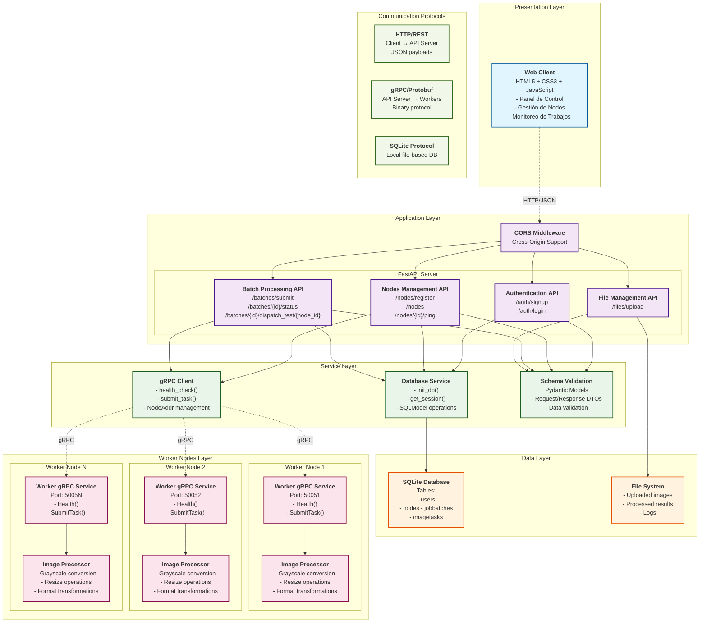

# Diagrama de Arquitectura UML - Sistema Distribuido de Procesamiento de Imágenes

## Características Arquitectónicas

### Patrones Implementados
1. **Layered Architecture**: Separación clara en capas de presentación, aplicación, servicios y datos
2. **Microservices Pattern**: Workers como servicios independientes
3. **API Gateway Pattern**: FastAPI actúa como gateway unificado
4. **Repository Pattern**: DBService abstrae el acceso a datos

### Protocolos de Comunicación
- **HTTP/REST**: Cliente web ↔ API Server (JSON)
- **gRPC/Protobuf**: API Server ↔ Workers (binario, alta performance)
- **SQLite**: Persistencia local de datos

### Escalabilidad
- **Horizontal**: Agregar más nodos workers
- **Vertical**: Mejorar recursos de workers individuales
- **Load Balancing**: Distribución de tareas entre workers disponibles

### Tolerancia a Fallos
- **Health Checks**: Monitoreo constante del estado de workers
- **Task Retry**: Posibilidad de reasignar tareas fallidas
- **Graceful Degradation**: El sistema continúa operando con workers reducidos