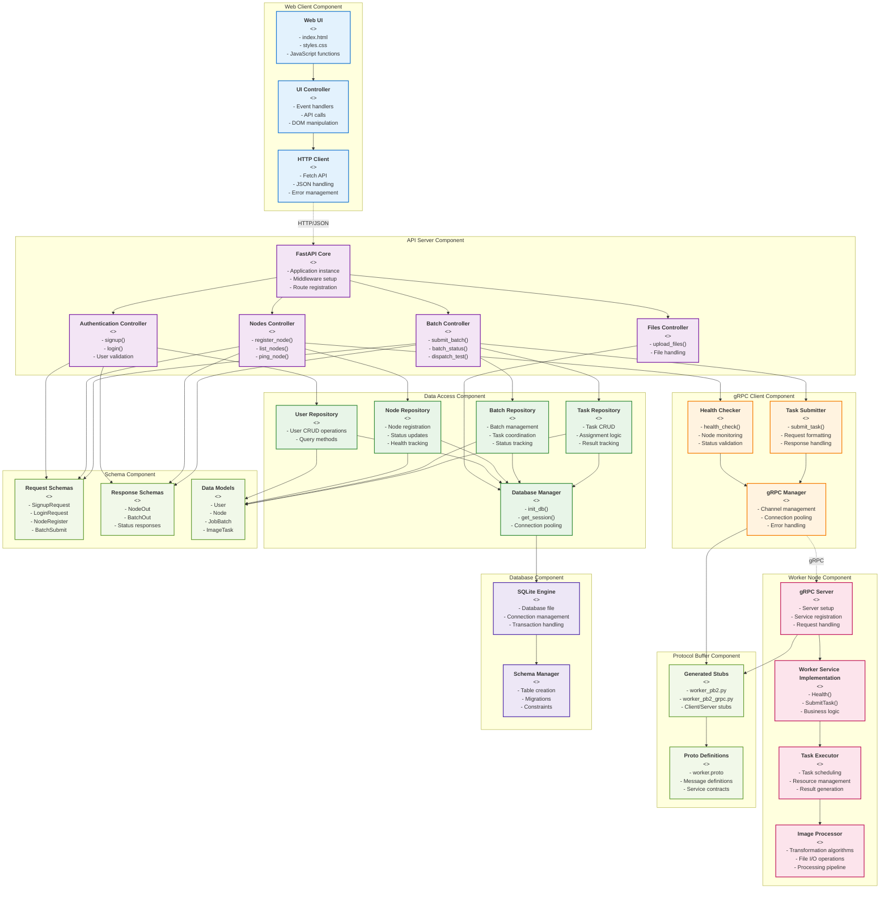

# Diagrama de Componentes UML - Sistema Distribuido de Procesamiento de Imágenes

## Descripción de Componentes

### Componentes Web Client
- **Web UI**: Interfaz de usuario HTML/CSS/JavaScript
- **UI Controller**: Maneja eventos y lógica de presentación
- **HTTP Client**: Comunicación con la API REST

### Componentes API Server
- **FastAPI Core**: Núcleo de la aplicación web
- **Controllers**: Manejan las rutas y lógica de negocio específica por dominio
- Separación clara de responsabilidades por funcionalidad

### Componentes Data Access
- **Database Manager**: Gestiona conexiones y sesiones de base de datos
- **Repositories**: Patrón Repository para cada entidad del dominio
- Abstracción completa del acceso a datos

### Componentes gRPC Client
- **gRPC Manager**: Gestiona las conexiones gRPC
- **Specialized Services**: Servicios específicos para salud y tareas
- Manejo robusto de comunicación distribuida

### Componentes Worker Node
- **gRPC Server**: Servidor de servicios distribuidos
- **Worker Service**: Implementación de la lógica de procesamiento
- **Image Processor**: Motor de transformación de imágenes
- **Task Executor**: Coordinador de ejecución de tareas

### Interfaces y Protocolos
- **REST API**: Comunicación cliente-servidor
- **gRPC**: Comunicación servidor-workers
- **Protocol Buffers**: Definición de contratos de comunicación
- **SQLite**: Persistencia de datos

### Beneficios del Diseño
1. **Separación de Responsabilidades**: Cada componente tiene un propósito específico
2. **Bajo Acoplamiento**: Interfaces bien definidas entre componentes
3. **Alta Cohesión**: Funcionalidad relacionada agrupada
4. **Reutilización**: Componentes pueden ser reutilizados en diferentes contextos
5. **Testabilidad**: Cada componente puede ser probado independientemente