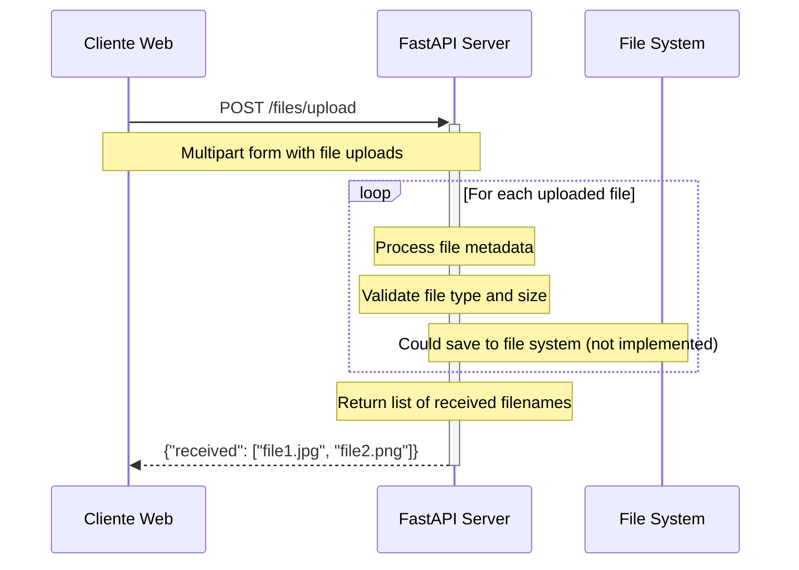
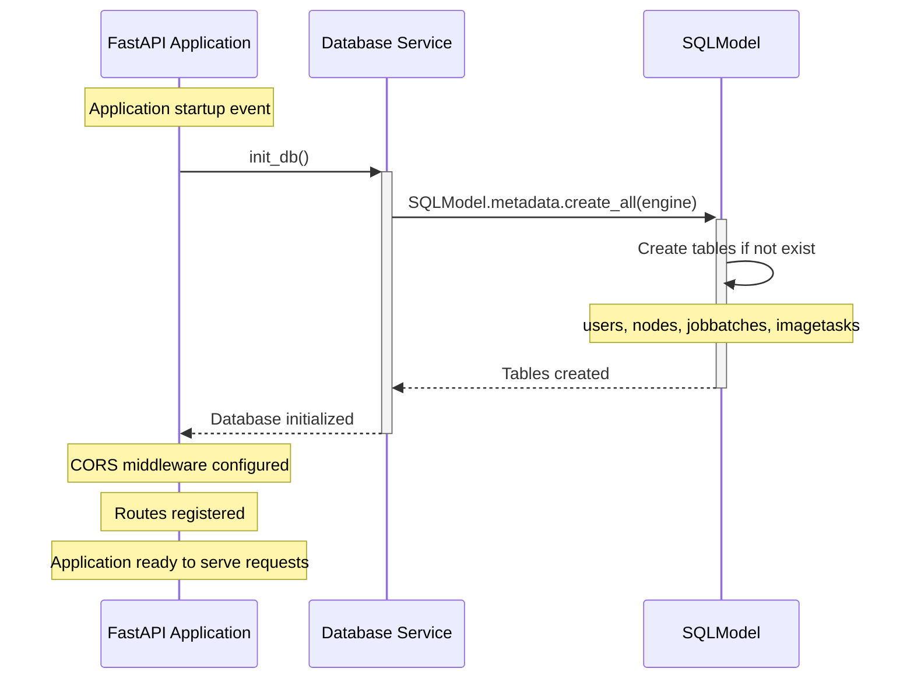

# Diagrama de Secuencia UML - Flujos Principales del Sistema Distribuido

## 1. Flujo de Registro de Usuario

```mermaid
sequenceDiagram
    participant C as Cliente Web
    participant API as FastAPI Server
    participant DB as Database
    participant Schema as Schema Validator

    C->>+API: POST /auth/signup
    Note over C,API: {"email": "user@domain.com", "name": "User Name"}
    
    API->>+Schema: Validate SignupRequest
    Schema-->>-API: Validation result
    
    alt Validation successful
        API->>+DB: Create User session
        API->>DB: INSERT User(email, name)
        DB-->>API: User created with ID
        API->>-DB: Commit transaction
        API-->>-C: {"user_id": 123, "message": "signup ok"}
    else Validation failed
        API-->>-C: {"error": "Invalid data"}
    end
```

## 2. Flujo de Registro de Nodo Worker

```mermaid
sequenceDiagram
    participant Worker as Worker Node
    participant API as FastAPI Server
    participant DB as Database
    participant Schema as Schema Validator

    Worker->>+API: POST /nodes/register
    Note over Worker,API: {"name": "worker1", "host": "localhost", "port": 50051}
    
    API->>+Schema: Validate NodeRegister
    Schema-->>-API: Validation result
    
    API->>+DB: Create session
    API->>DB: INSERT Node(name, host, port, status="inactive")
    DB-->>API: Node created with ID
    API->>-DB: Commit transaction
    
    API-->>-Worker: {"id": 1, "name": "worker1", "host": "localhost", "port": 50051, "status": "inactive"}
```

## 3. Flujo de Health Check de Nodos

```mermaid
sequenceDiagram
    participant C as Cliente Web
    participant API as FastAPI Server
    participant DB as Database
    participant gRPC as gRPC Client
    participant Worker as Worker Node

    C->>+API: POST /nodes/{node_id}/ping
    
    API->>+DB: Get session
    API->>DB: SELECT Node WHERE id = node_id
    DB-->>API: Node data
    API->>-DB: Close session
    
    alt Node exists
        API->>+gRPC: health_check(NodeAddr)
        gRPC->>+Worker: gRPC Health()
        Worker-->>-gRPC: HealthReply{status: "OK"}
        gRPC-->>-API: "OK"
        
        API->>+DB: Update session
        API->>DB: UPDATE Node SET status="active", last_heartbeat=now()
        API->>-DB: Commit transaction
        
        API-->>-C: {"node_id": 1, "status": "active"}
    else Node not found
        API-->>-C: {"ok": false, "message": "node not found"}
    end
```

## 4. Flujo de Envío de Lote de Procesamiento

```mermaid
sequenceDiagram
    participant C as Cliente Web
    participant API as FastAPI Server
    participant DB as Database
    participant Schema as Schema Validator

    C->>+API: POST /batches/submit
    Note over C,API: BatchSubmit{user_id, images[], note}
    
    API->>+Schema: Validate BatchSubmit
    Schema-->>-API: Validation result
    
    API->>+DB: Begin transaction
    API->>DB: INSERT JobBatch(user_id, status="processing", note)
    DB-->>API: Batch created with ID
    
    loop For each image in request
        API->>DB: INSERT ImageTask(batch_id, image_id, transformations, status="queued")
    end
    
    API->>-DB: Commit transaction
    
    API-->>-C: {"batch_id": 456, "status": "processing"}
```

## 5. Flujo de Procesamiento de Tarea (Dispatch Test)

```mermaid
sequenceDiagram
    participant C as Cliente Web
    participant API as FastAPI Server
    participant DB as Database
    participant gRPC as gRPC Client
    participant Worker as Worker Node

    C->>+API: POST /batches/{batch_id}/dispatch_test/{node_id}
    
    API->>+DB: Get session
    API->>DB: SELECT Node WHERE id = node_id
    DB-->>API: Node data
    API->>DB: SELECT ImageTask WHERE batch_id = batch_id LIMIT 1
    DB-->>API: Task data
    
    alt Node and Task exist
        API->>+gRPC: submit_task(NodeAddr, request_id, image_id, operation)
        gRPC->>+Worker: gRPC SubmitTask(TransformTask)
        
        Note over Worker: Process image transformation
        Worker-->>-gRPC: TransformReply{status, result_path, log_message}
        gRPC-->>-API: Transform result
        
        alt Processing successful
            API->>DB: UPDATE ImageTask SET status="done", node_id=node_id, result_path=result_path
        else Processing failed
            API->>DB: UPDATE ImageTask SET status="error", node_id=node_id
        end
        
        API->>-DB: Commit transaction
        API-->>-C: {"ok": true, "worker_reply": {...}}
    else Missing node or task
        API->>-DB: Close session
        API-->>-C: {"ok": false, "message": "node/task not found"}
    end
```

## 6. Flujo de Consulta de Estado de Lote

```mermaid
sequenceDiagram
    participant C as Cliente Web
    participant API as FastAPI Server
    participant DB as Database

    C->>+API: GET /batches/{batch_id}/status
    
    API->>+DB: Get session
    API->>DB: SELECT JobBatch WHERE id = batch_id
    DB-->>API: Batch data
    
    alt Batch exists
        API->>DB: SELECT ImageTask WHERE batch_id = batch_id
        DB-->>API: List of tasks
        API->>-DB: Close session
        
        Note over API: Build response with batch status and task details
        
        API-->>-C: {"batch_id": 456, "status": "processing", "tasks": [...]}
    else Batch not found
        API->>-DB: Close session
        API-->>-C: {"ok": false, "message": "batch not found"}
    end
```

## 7. Flujo de Subida de Archivos



## 8. Flujo de Arranque del Sistema



## Características de los Flujos

### Patrones Implementados
- **Request-Response**: Comunicación síncrona entre cliente y servidor
- **Transaction Management**: Operaciones atómicas en base de datos
- **Error Handling**: Validación y manejo de errores en cada flujo
- **Resource Management**: Gestión adecuada de conexiones y sesiones

### Protocolos de Comunicación
- **HTTP/REST**: Cliente ↔ API Server (JSON requests/responses)
- **gRPC**: API Server ↔ Workers (binary protocol)
- **SQL**: API Server ↔ Database (relational operations)

### Aspectos de Concurrencia
- **Database Sessions**: Manejo independiente de sesiones por request
- **gRPC Channels**: Comunicación concurrente con múltiples workers
- **Async Processing**: Capacidad de procesamiento asíncrono de tareas

### Tolerancia a Fallos
- **Graceful Error Handling**: Respuestas coherentes ante errores
- **Transaction Rollback**: Consistencia de datos ante fallos
- **Worker Health Monitoring**: Detección y manejo de workers no disponibles