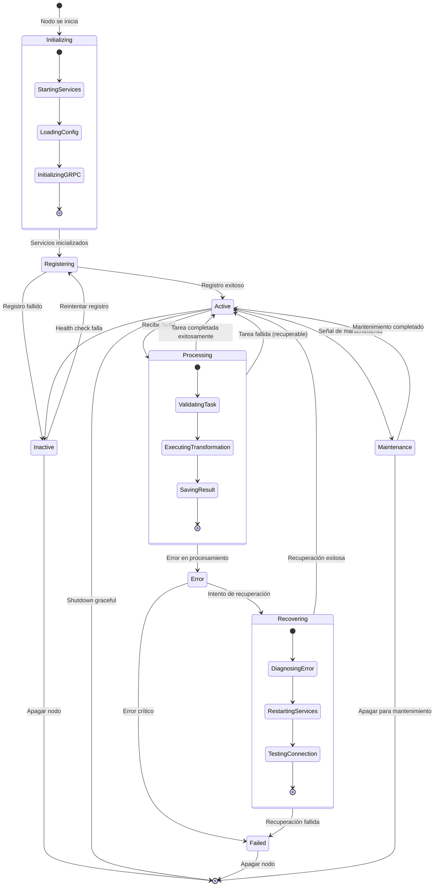
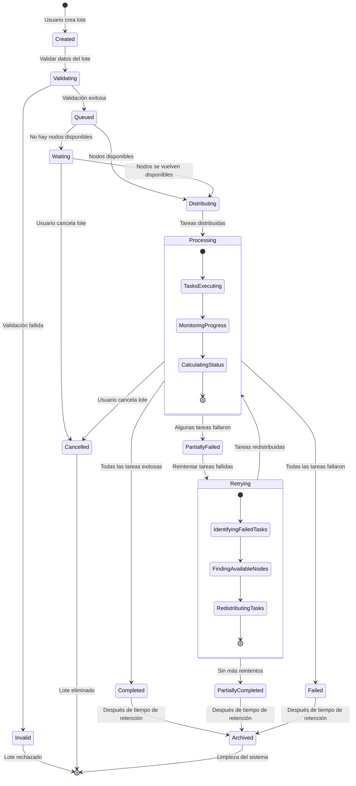
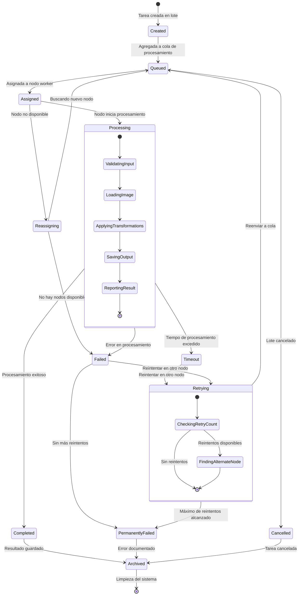
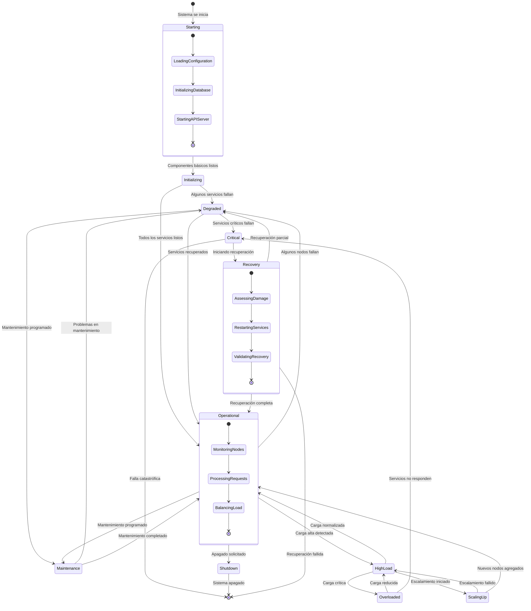
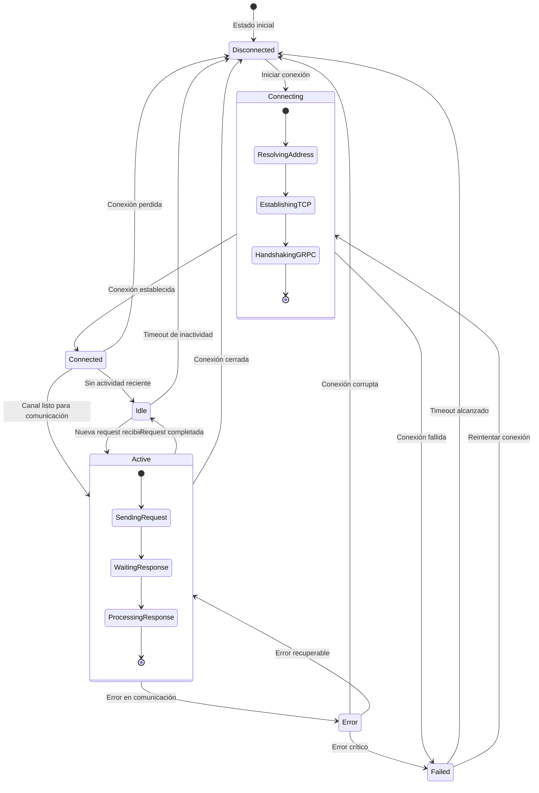

# Diagrama de Estados UML - Sistema Distribuido de Procesamiento de Imágenes

## 1. Estados del Nodo Worker

## 2. Estados del Lote de Procesamiento (JobBatch)

## 3. Estados de la Tarea Individual (ImageTask)

## 4. Estados del Sistema Distribuido

## 5. Estados de la Conexión gRPC

## Características de los Diagramas de Estados

### Gestión de Estados Complejos
- **Estados Anidados**: Composición de estados para modelar comportamientos complejos
- **Transiciones Condicionadas**: Cambios de estado basados en condiciones específicas
- **Estados Paralelos**: Múltiples máquinas de estado operando simultáneamente

### Manejo de Errores y Recuperación
- **Estados de Error**: Diferenciación entre errores recuperables y críticos
- **Patrones de Recuperación**: Secuencias definidas para recuperación de fallos
- **Timeout Handling**: Gestión de timeouts en comunicaciones y procesamiento

### Optimización y Performance
- **Estados de Carga**: Diferentes comportamientos según la carga del sistema
- **Escalamiento Dinámico**: Estados que manejan el crecimiento de recursos
- **Balanceo de Carga**: Estados que optimizan la distribución de trabajo

### Persistencia y Limpieza
- **Estados de Archivo**: Gestión del ciclo de vida de datos procesados
- **Limpieza Automática**: Transiciones para liberación de recursos
- **Retención de Datos**: Políticas de mantenimiento de información histórica

### Sincronización y Coordinación
- **Estados de Sincronización**: Coordinación entre componentes distribuidos
- **Estados de Consenso**: Acuerdo entre nodos sobre el estado del sistema
- **Estados de Consistencia**: Mantenimiento de coherencia de datos distribuidos